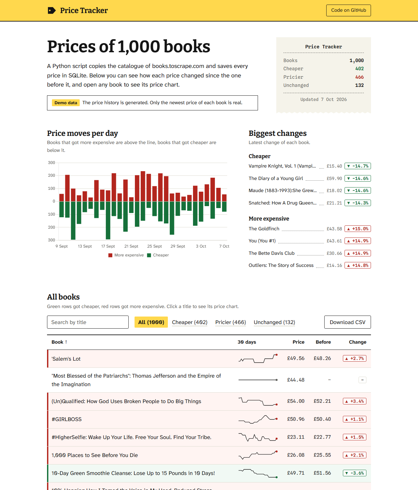
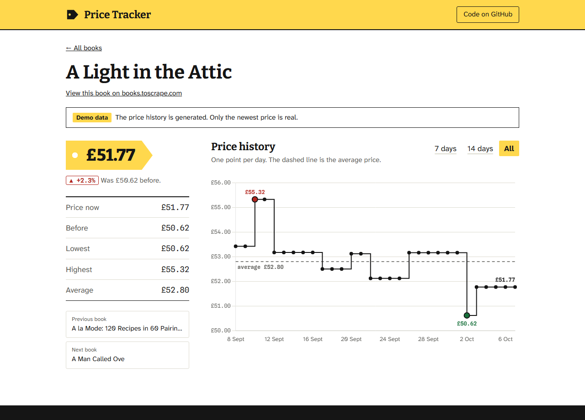

# Price Tracker

**Live demo: https://hassimx.github.io/price-tracker/**

A small tool that collects book prices from [books.toscrape.com](https://books.toscrape.com), a practice site for scrapers. A Python scraper saves every price in SQLite. A Flask app and a plain JavaScript page show what changed: the current and previous price, the change in percent, a trend line for every book and a price chart for each title. You can also download the table as CSV.

The live demo uses generated price history, see "Demo data" below.





## Install and run

You need Python 3.9 or newer (I tested it on 3.14).

```bash
git clone https://github.com/hassimx/price-tracker.git
cd price-tracker
python -m venv .venv
```

Activate the virtual environment.

```bash
# Windows
.venv\Scripts\activate

# macOS / Linux
source .venv/bin/activate
```

On Windows PowerShell you may see "running scripts is disabled on this system". You can skip the activation. Just start every command with `.venv\Scripts\python`, for example `.venv\Scripts\python -m pip install -r requirements.txt` and `.venv\Scripts\python scraper.py`.

Install the packages, collect the prices and start the site.

```bash
pip install -r requirements.txt
python scraper.py
python app.py
```

Open http://127.0.0.1:5000 in your browser.

The scraper reads all 50 catalog pages (1000 books) and waits one second between requests, so it takes about two minutes. For a quick try use `python scraper.py --pages 3`. Run it again any time. Books are not duplicated, each run only adds a new price to the history.

## Demo data

The real prices on books.toscrape.com never change, so every chart would be a flat line. `seed_demo.py` fills the database with made-up price history for the last 30 days.

```bash
python seed_demo.py
```

This is fake data. The newest price of each book is the real one from the scraper, everything before it is random. The script replaces the price history in your local database, and the page says "Demo data" while it is there. To go back to real data only, delete `prices.db` and run the scraper again.

## Online demo

GitHub Pages cannot run Flask, so the online version is a static copy. `build_static.py` saves the same page and its data as plain files in `docs/`, and GitHub Pages serves that folder.

```bash
python build_static.py
```

Commit the changed files in `docs/` and push to update the live demo.

## What I learned

The tricky part was the previous price. The scraper saves a row on every run, even when nothing changed, so the previous price has to be the last price that was different from the current one. I also found out that GitHub Pages cannot run Flask, so I moved the display logic into JavaScript that reads one `data.json`. Flask serves that file from SQLite, and `build_static.py` saves it as a file for the online demo.
